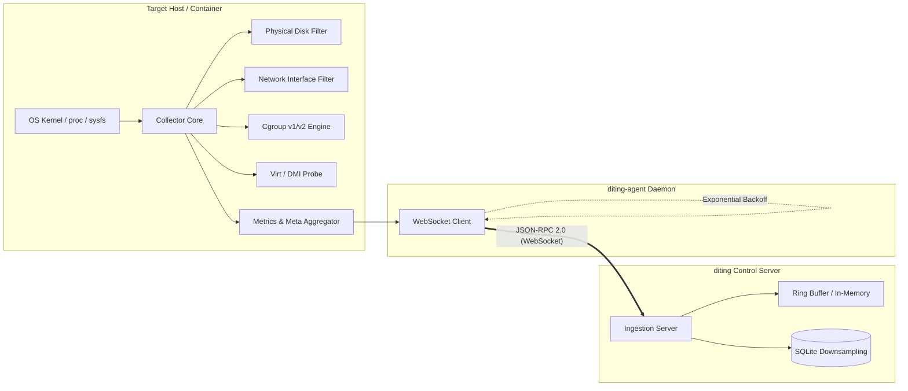

# Diting Agent (`diting-agent`)

[](https://pkg.go.dev/github.com/diting-monitor/diting-agent)
[](https://golang.org)
[](LICENSE)

Ultra-lightweight, read-only host telemetry probe for the **Diting (谛听)** observability ecosystem.

> *“善听天地，悉知万机”* — Omniscient listener of hosts and systems.

---

## 💡 Design Principles

`diting-agent` is designed with strict anti-bloat principles:

- **Lean Agent, Fat Server (瘦客户端，厚服务端)**: Agent strictly consumes $\le 8\text{MB}$ resident memory (RSS). It reads raw kernel and system metrics, performs differential rate calculation, and pushes lightweight JSON-RPC 2.0 frames over WebSocket every 2 seconds. All downsampling, aggregation, and GeoIP resolutions are handled by the server.
- **Strictly Read-Only (绝不做控制面板)**: No remote command execution, no WebSSH, no backdoor management, no proxying. Diting only observes and reports host telemetry without interfering with system operations.
- **Zero CGO & Pure Go**: Built with `CGO_ENABLED=0` static compilation, requiring zero external dynamic C libraries. Effortlessly cross-compiles to Linux (amd64, arm64, armv7, riscv64, mips), macOS (Darwin), and Windows.
- **Hardened Kernel & System Collectors**:
  - **Smart Disk Deduplication**: Identifies physical drive geometry, merges APFS/Linux partition aliases, and excludes pseudo-filesystems and hanging network shares (NFS, CIFS, SMB).
  - **Virtual Network Interface Filtering**: Filters out Docker bridges, veth pairs, CNI/flannel overlays, and VPN tunnels to report genuine physical bandwidth and traffic rates.
  - **Cgroup v1 / v2 Container Awareness**: Transparently detects container memory and CPU quota limits when deployed inside Docker or Kubernetes.
  - **Zero-Allocation Linux Socket Accounting**: Fast Linux `/proc/net` scanner counts active TCP and UDP connections with zero heap allocation, backed by cross-platform fallbacks for macOS and Windows.
  - **Hardware Virtualization Detection**: Inspects DMI / SMBIOS tables and system markers to accurately identify hypervisors (KVM, VMware, Hyper-V, Xen, Docker, LXC, or bare metal).

---

## 🏗️ Architecture



---

## ⚙️ Configuration

`diting-agent` supports configuration via command-line flags and environment variables. Command-line flags take precedence over environment variables.

| CLI Flag | Short | Environment Variable | Default | Description |
| :--- | :--- | :--- | :--- | :--- |
| `--server` | `-s` | `DITING_SERVER_URL` | `ws://127.0.0.1:8080/api/v1/ws/rpc` | Target server WebSocket RPC endpoint (`ws://` or `wss://`) |
| `--token` | `-t` | `DITING_TOKEN` | *(Required)* | Node authentication token for server connection |
| `--interval`| `-i` | `DITING_REPORT_INTERVAL` | `2s` | Telemetry reporting interval (minimum: `500ms`) |
| `--version` | `-v` | — | — | Print agent version and exit |

---

## 🚀 Quick Start

### 1. Build from Source

Requirements: Go 1.24 or later.

```bash
# Clone repository
git clone https://github.com/diting-monitor/diting-agent.git
cd diting-agent

# Build static binary with version metadata
CGO_ENABLED=0 go build -trimpath -ldflags="-s -w -X 'github.com/diting-monitor/diting-agent/internal/version.Version=v0.1.0'" -o diting-agent main.go
```

#### Cross-Compilation Examples

```bash
# Linux amd64 (x86_64)
CGO_ENABLED=0 GOOS=linux GOARCH=amd64 go build -trimpath -ldflags="-s -w" -o diting-agent-linux-amd64 main.go

# Linux arm64 (aarch64)
CGO_ENABLED=0 GOOS=linux GOARCH=arm64 go build -trimpath -ldflags="-s -w" -o diting-agent-linux-arm64 main.go

# Windows amd64
CGO_ENABLED=0 GOOS=windows GOARCH=amd64 go build -trimpath -ldflags="-s -w" -o diting-agent-windows-amd64.exe main.go
```

### 2. Run Directly

```bash
# Using CLI options
./diting-agent -s wss://diting.example.com/api/v1/ws/rpc -t "YOUR_NODE_TOKEN"

# Or using environment variables
export DITING_SERVER_URL="wss://diting.example.com/api/v1/ws/rpc"
export DITING_TOKEN="YOUR_NODE_TOKEN"
./diting-agent
```

### 3. Deploy as a Systemd Service

Create `/etc/systemd/system/diting-agent.service`:

```ini
[Unit]
Description=Diting Agent Telemetry Daemon
After=network.target

[Service]
Type=simple
User=root
ExecStart=/usr/local/bin/diting-agent -s wss://diting.example.com/api/v1/ws/rpc -t YOUR_NODE_TOKEN
Restart=always
RestartSec=5s
LimitNOFILE=65535

[Install]
WantedBy=multi-user.target
```

Enable and start the service:

```bash
sudo systemctl daemon-reload
sudo systemctl enable --now diting-agent
sudo journalctl -u diting-agent -f
```

---

## 🧪 Testing

Run test suite with race condition detection:

```bash
go test -v -race ./...
```

---

## 📄 License

This project is licensed under the [MIT License](LICENSE).
